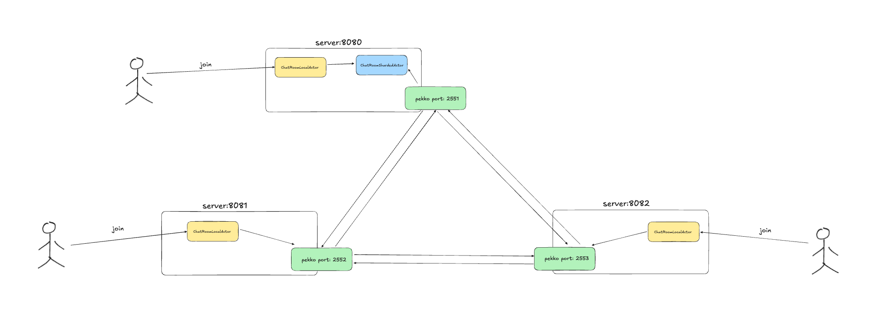
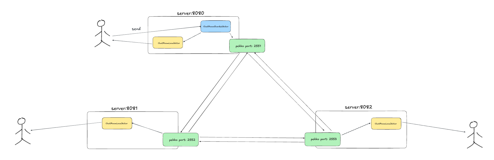

# voyager-actor-template

- Spring boot + pekko
  - Spring for DI(dependency inversion) and web request handling 
  - Pekko for clustering and sharding actors 

## How to start

```shell
# start cluster: starts 3 local servers and cluster them  
$ sh cluster-start.sh 

# stop cluster
$ sh cluster-stop.sh

# start frontend 
$ cd frontend 
$ npm start 
```

## How it works 

### Join


### Send 

